## æ’件整ç†

|æ’件å|功能说æ˜|
| --------------------------------------| :--------------------------------------------------------------------------------------------------------------------------------------------------------------------------------------------------------------------------------------------------------------------------------------------------------------------------------------------------------------------------|
|🔥 Show Comment|在结æ„树显示 文档注释；在行末尾显示 æ–‡æ¡£æ³¨é‡Šï¼›æ”¯æŒ "xx 类全å或简å.json" 文档注释ä¸è·³è½¬åˆ°å­—æ®µï¼›æ”¯æŒ ä»é…置文件è·å–外部注释用äºæ–‡ä»¶å¤¹ã€èµ„æºã€COBOL ç­‰<br />|
|🔥Draw Graph|ç”Ÿæˆ æ–¹æ³•è°ƒç”¨å›¾ å’Œ Maven ä¾èµ–图|
|🔥 .ignore|Git æ交忽略一些文件|
|AceJump|AceJump å…许您快速将æ’入符å·å¯¼èˆªåˆ°ç¼–辑器中å¯è§çš„任何ä½ç½®ã€‚åªéœ€æŒ‰â€œctrl+;â€ï¼Œè¾“入一个字符，然å输入匹é…的字符å³å¯è¿›è¡Œä»»æ„ä½ç½®è·³è½¬ã€‚|
|Alibaba Cloud Toolkit|阿里云工具包是 Eclipse 或 IntelliJ IDEA ç­‰ IDE çš„æ’件。帮助开å‘人员更高效地开å‘ã€ç¼–ç ã€æµ‹è¯•ã€è¯Šæ–­å’Œéƒ¨ç½²é€‚åˆäº‘æ“作的应用程åºã€‚|
|arthas idea|åŸºäº IntelliJ IDEA å¼€å‘çš„ Alibaba Arthas 命令生æˆæ’ä»¶ï¼Œæ”¯æŒ [Alibaba Arthas](https://arthas.aliyun.com/doc/) 官方常用的命令。|
|Awesome Console|有了这个æ’件，æ§åˆ¶å°å’Œç»ˆç«¯ä¸­çš„所有文件和链æ¥éƒ½ä¼šè¢«é«˜äº®æ˜¾ç¤ºå¹¶å¯ä»¥ç‚¹å‡»ã€‚æºä»£ç æ–‡ä»¶å°†åœ¨ IDE 中打开，其他链æ¥å°†ç”¨è¯¥ç±»å‹çš„默认查看器/æµè§ˆå™¨æ‰“开。|
|any-rule|常用正则大全，快速æœç´¢ã€æ˜“äºä½¿ç”¨ã€‚å¯ä¸è£…，官方æ供在线版 [https://any-rule.vercel.app/](https://any-rule.vercel.app/)|
|🔥 AnyDoor|目标：执行 Spring 项目任æ„对象的任æ„方法。<br />1. 对äºæ˜¯ Spring 注册的 Bean，会通过上下文拿到对象（若有代ç†æ—¢æ˜¯ä»£ç†å¯¹è±¡ï¼‰ï¼Œæ‰§è¡Œå½“å‰æ–¹æ³•ï¼›<br />2. 对äºé Spring 注册的 Bean，会通过å射创建对象，执行当å‰æ–¹æ³•<br />|
|Better Highlights|为注释ç€è‰²ã€åœ¨æ³¨é‡Šä¸­å¼•ç”¨æºä»£ç ã€æ˜¾ç¤ºæ–¹æ³•çš„认知å¤æ‚度ã€é«˜äº®æ˜¾ç¤ºåŒºåŸŸï¼ˆæ•´è¡Œé«˜äº®ï¼‰ã€åœ¨æ³¨é‡Šä¸­å¼•ç”¨æ–‡ä»¶ã€åœ¨æ³¨é‡Šä¸­å¼•ç”¨å…¶ä»–注释ã€é«˜äº®æ˜¾ç¤ºå…³é”®å­—（语法高亮）ã€é€šè¿‡ RegExp 高亮显示任何内容。|
|🔥 CamelCase|在 kebab-caseã€SNAKE_CASEã€PascalCaseã€camelCaseã€snake_case 或 space case 之间轻æ¾åˆ‡æ¢ã€‚（å˜é‡å‘½å转æ¢ï¼‰|
|CodeGlance|å°†ç±»ä¼¼äº Sublime 中的代ç å°åœ°å›¾åµŒå…¥åˆ°ç¼–辑器窗格中。|
|🔥 CodeGlance Pro|åœ¨ç¼–è¾‘å™¨çª—æ ¼ä¸­æ˜¾ç¤ºä¸€ä¸ªç±»ä¼¼äº Sublime 中的放大概览或最å°åœ°å›¾ã€‚å°åœ°å›¾å…许快速滚动，让你直æ¥è·³åˆ°ä»£ç çš„å„个部分。对 CodeGlance 进行é‡åšï¼Œæ”¯æŒæ›´å¤šçš„功能|
|Code Review Helper|Intellij IDEA的一个 Code Review 代ç æ£€è§†ã€ä»£ç è¯„审的æ’件。å¯ä»¥åœ¨æœ¬åœ°çš„IDEA工具中进行添加检视æ„è§ã€è¯„审æ„è§ç­‰ï¼Œæ”¯æŒExcel导入导出，å¯è§†åŒ–ç•Œé¢ï¼Œæ–¹ä¾¿é¡¹ç›®ä¸­ä»£ç èµ°è¯»ã€‚[å¼€æºåœ°å€](https://gitee.com/veezean/IntellijIDEA-CodeReview-Plugin)|
|🔥 CommitMessage|æ交信æ¯æ¨¡æ¿ç”Ÿæˆæ’件，用äºè§„范代ç æ交信æ¯|
|🔥 JsonToAnyLanguage（$15/年）|日常开å‘中，我们ç»å¸¸è¦ä½¿ç”¨æ’件æ¥å®ç° JSON 转业务å®ä½“，但是目å‰æ’件市场没有一款æ’件å¯ä»¥åŒæ—¶æ”¯æŒç”Ÿæˆå¤šç§è¯­è¨€ï¼Œå¯¼è‡´éœ€è¦ä¸‹è½½å¾ˆå¤šä¸ªæ’件，很多强迫症患者是无法æ¥å—的。<br />基äºè¿™ä¸ªèƒŒæ™¯ï¼Œè¿™ä¸ªæ’件，统一把这些功能集æˆåˆ°ä¸€ä¸ªæ’件中å»ã€‚<br />该功能使用 [quicktype](https://quicktype.io/) å®ç°<br />|
|🔥 Easy Javadoc|这个æ’件å¯ä»¥å¸®åŠ©ä½ å¿«é€Ÿå®Œæˆä¸­æ–‡ javadoc 文档。支æŒä¸‰ç§ç±»å‹çš„ javadoc：字段ã€æ–¹æ³•å’Œç±»ã€‚|
|EasyCode|åŸºäº IntelliJ IDEA å¼€å‘的代ç ç”Ÿæˆæ’件，支æŒè‡ªå®šä¹‰ä»»æ„模æ¿ï¼ˆJava，html，js，xml）。<br />åªè¦æ˜¯ä¸æ•°æ®åº“相关的代ç éƒ½å¯ä»¥é€šè¿‡è‡ªå®šä¹‰æ¨¡æ¿æ¥ç”Ÿæˆã€‚支æŒæ•°æ®åº“ç±»å‹ä¸ java ç±»å‹æ˜ å°„关系é…置。<br />支æŒåŒæ—¶ç”Ÿæˆç”Ÿæˆå¤šå¼ è¡¨çš„代ç ã€‚æ¯å¼ è¡¨æœ‰ç‹¬ç«‹çš„é…置信æ¯ã€‚完全的个性化定义，规则由你设置。<br />|
|🔥 EasyCode-MybatisCodeHelper|基äºIntelliJ IDEAå¼€å‘的代ç ç”Ÿæˆæ’件，支æŒè‡ªå®šä¹‰ä»»æ„模æ¿ï¼ˆJava，html，js，xml）。<br />支æŒKotlin代ç ç”Ÿæˆã€‚<br />åªè¦æ˜¯ä¸æ•°æ®åº“相关的代ç éƒ½å¯ä»¥é€šè¿‡è‡ªå®šä¹‰æ¨¡æ¿æ¥ç”Ÿæˆã€‚支æŒæ•°æ®åº“ç±»å‹ä¸javaç±»å‹æ˜ å°„关系é…置。<br/>支æŒåŒæ—¶ç”Ÿæˆç”Ÿæˆå¤šå¼ è¡¨çš„代ç ã€‚æ¯å¼ è¡¨æœ‰ç‹¬ç«‹çš„é…置信æ¯ã€‚完全的个性化定义，规则由你设置。<br/>æ’件forkäºeasy codeæ’件，该版本用äºå…¼å®¹MybatisCodeHelperæ’件，方便MybatisCodeHelperæ’件åšä»£ç ç”Ÿæˆè¡¥å…¨æ£€æµ‹ç­‰<br/>支æŒä»é¡¹ç›®çš„easyCode目录里é¢çš„模版文件æ¥ç”Ÿæˆä»£ç  表上å³é”®GenerateFromEasyCodeFolderFileå³å¯<br/>写模版有代ç æ示,更好的报错æ示,支æŒè‡ªå®šä¹‰å¤šä¸ªgroupæ¥ç”Ÿæˆä»£ç ã€‚<br/>（<b>模æ¿å¯ä»¥é¡¹ç›®ç»„共享，个人感觉比EasyCode好用</b>）|
|EasyYapi|帮助你导出 api 到 yapi ã€postman ã€markdownï¼ˆåŸºäº javadoc & KDoc & ScalaDoc 解æ API 文档）<br />ä¸ä½¿ç”¨ [YApi](https://hellosean1025.github.io/yapi/) å¯ä¸è£…，若使用 [YApi](https://hellosean1025.github.io/yapi/) 管ç†æ¥å£æ–‡æ¡£ï¼Œæ¨è安装。|
|element|æ”¯æŒ element 框æ¶ï¼Œåœ¨ä½¿ç”¨è¿™ä¸ªæ’件之å‰ï¼Œä½ å¿…须安装æ’件 vuejs|
|GitToolBox|Git 工具箱。扩展 Git 功能：状æ€æ˜¾ç¤ºã€è‡ªåŠ¨è·å–ã€å†…è”错误注释ã€æ交对è¯æ¡†å®Œæˆã€éšè—通知...|
|🔥 Grep Console|Grepã€tailã€filterã€highlight... æ§åˆ¶å°æ‰€éœ€çš„一切。也å¯ä»¥é«˜äº®ç¼–辑器...|
|🔥 Gyro|Gyro-让你的本地集æˆæµ‹è¯•ä¸€ç›´è¿è¡Œï¼Œå°±åƒ @SpringBootTest å¯åŠ¨çš„那样。第一次è¿è¡Œ Gyro Debug 时，需è¦å¯åŠ¨ Spring 容器。当你å†æ¬¡è¿è¡Œ Gyro Debug 时，Gyro å°†é‡ç”¨ä¹‹å‰å¯åŠ¨çš„ Spring 容器。<br />安装 Jrebel 热部署æ’件会自动使用 Jrebel 热部署能力（如æœæ²¡æœ‰ç”Ÿæ•ˆï¼Œå¯ä»¥é€šè¿‡ Preferences->Tools->Gyro Settings é…ç½® Jrebel 代ç†è·¯å¾„）；åŒæ ·ï¼Œæ‚¨å¯ä»¥ä½¿ç”¨å®ƒæ¥é¢„热您的其他测试任务。<br />|
|Keep Unit Test Running|以è¿ç»­æ¨¡å¼è¿è¡Œ JUnit 或 TestNG 测试 -> 如æœä¿®æ”¹æµ‹è¯•ï¼Œæ— éœ€é‡æ–°å¯åŠ¨æ•´ä¸ªåº”ç”¨ç¨‹åº -> æ高工作效ç‡ã€‚ä¸ Spring å’Œ Cucumber é…åˆä½¿ç”¨æ•ˆæœç‰¹åˆ«å¥½ã€‚（SpringBoot 支æŒå¾ˆå·®ï¼‰|
|JFormDesigner|先进的 Swing GUI 设计器，对 MigLayoutã€JGoodies FormLayoutã€GroupLayout (Free Design)ã€TableLayout å’Œ GridBagLayout 的出色支æŒï¼Œä½¿å…¶èƒ½å¤Ÿè½»æ¾åˆ›å»ºä¸“业外观的表å•ã€‚|
|🔥 JRebel and XRebel|JRebel 是一ç§ç”Ÿäº§åŠ›å·¥å…·ï¼Œå…许开å‘人员立å³é‡æ–°åŠ è½½ä»£ç æ›´æ”¹ã€‚它跳过了 Java å¼€å‘中常è§çš„é‡å»ºã€é‡æ–°å¯åŠ¨å’Œé‡æ–°éƒ¨ç½²å‘¨æœŸã€‚<br />XRebel æ˜¯ä¸€ä¸ªç”¨äº Java å¼€å‘的性能工具，它为开å‘人员æä¾›å®æ—¶æ€§èƒ½æ´å¯Ÿï¼Œå¸®åŠ©ä»–们在开å‘阶段更快ã€æ›´æ—©åœ°ç†è§£å’Œè§£å†³æ½œåœ¨é—®é¢˜ã€‚<br />|
|🔥 JRebel mybatisPlus extension|ç”¨äº IntelliJ çš„ JRebel MybatisPlus 热é‡è½½æ‰©å±•|
|Jump to Line|Jump to Line æ’件å…许您在调试时访问任何代ç è¡Œã€‚将黄色箭头拖放到æ’水沟中的所需ä½ç½®ï¼Œå®ƒå°†åœ¨é‚£é‡Œæ”¾ç½®ä¸€ä¸ªæ‰§è¡Œç‚¹ã€‚<br />ä¸æ­¥è¿›ç›¸æ¯”，该æ’件使您å¯ä»¥ä»è¯¥ç‚¹å¼€å§‹è¿è¡Œç¨‹åºï¼Œè€Œæ— éœ€æ‰§è¡Œå‰é¢çš„代ç ã€‚<br />|
|🔥 Maven Helper|使用 Maven 的必备æ’件。（分æå’Œæ’除冲çªä¾èµ–项的简å•æ–¹æ³•ï¼‰|
|🔥 maven-search|快速查找 maven ä¾èµ–，定制模糊查找算法。支æŒæŸ¥æ‰¾å…¨ç½‘类。ä¸ä¾èµ–äºå›½å¤–网络，æ¯å‘¨è‡ªåŠ¨å» Maven 仓库åŒæ­¥ç´¢å¼•åˆ°å›½å†…。<br />在线版：[https://mvn.coderead.cn/](https://mvn.coderead.cn/)<br />|
|MetricsReloaded|分æ代ç å¤æ‚度的æ’件|
|Momo Code Sec Inspector（Java）|Java é™æ€ä»£ç å®‰å…¨å®¡è®¡æ’件。具有一键修å¤åŠŸèƒ½çš„é™æ€ä»£ç æ£€æŸ¥å™¨ã€‚|
|🔥 MyBatisCodeHelperPro（¥99/3 年）|Intellij 下 Mybatis 支æŒæ’件，功能强大（[详细介ç»](https://gejun123456.github.io/MyBatisCodeHelper-Pro/#/)）。ä¸æƒ³ä»˜è´¹é‚£å°±ç”¨ [MyBatisX](https://plugins.jetbrains.com/plugin/10119-mybatisx)|
|🔥 Rainbow Brackets（¥280/永久）|彩虹括å·ï¼Œé«˜äº®æ‹¬å·å¯¹ã€‚注æ„，会检测 `ja-netfilter` 。付费都无法使用用ï¼ï¼ï¼å¯ä»¥ç”¨å…费版。|
|🔥 HighlightBracketPair|该æ’件å¯ä»¥åœ¨ IntelliJ 的编辑器中对括å·å¯¹è¿›è¡Œé¢œè‰²çªå‡ºæ˜¾ç¤ºã€‚|
|🔥 Restful Fast Request（$19/年）|Restful Fast Request 是一个强大的 restful api 工具包æ’件（http 客户端），帮助您通过 exist æ–¹æ³•å¿«é€Ÿç”Ÿæˆ url å’Œ params。<br />æ’件= API 调试工具 + API 管ç†å™¨å·¥å…·ã€‚<br />|
|RestfulToolkitX|RestfulToolkitX 是è¿è¡Œåœ¨Intellij IDEA 之上的一个é常棒的 RESTful å¼€å‘工具包。（主è¦ç”¨æ¥æœç´¢æ¥å£ï¼‰|
|🔥 Apipost-Helper|Apipost ä¸€ä¸ªç±»ä¼¼äº Postman çš„ IntelliJ IDEA æ’件，å¯ä»¥å¸®åŠ©å¼€å‘人员高效地调试 Api 并一键生æˆæ–‡æ¡£ï¼›Apipost \= Restfultool + Yapidoc + Swaggertoolï¼›|
|RequestTool|[RequestTool](https://licheng1013.github.io/plugins/request-tool.html) 一个 Http 请求工具，您å¯ä»¥æ ¹æ®è¯·æ±‚结æœæ„建自己的文档，支æŒæ–‡æ¡£å¯¼å‡ºã€‚ï¼ˆä¸ Restful Fast Request 相比，个人觉得能达到近 2/3 å§ï¼‰<br />|
|Save Actions|支æŒå¯é…置的ã€ç±»ä¼¼ Eclipse çš„ä¿å­˜æ“作，包括“优化导入â€ã€â€œé‡æ–°æ ¼å¼åŒ–代ç â€ã€â€œé‡æ–°æ’列代ç â€ã€â€œç¼–译文件â€ä»¥åŠä¸€äº›é’ˆå¯¹ Java 的快速修å¤ï¼Œ<br />如“添加/删除 'this' é™å®šç¬¦â€ç­‰ã€‚当文件在ç£ç›˜ä¸ŠåŒæ­¥ï¼ˆæˆ–ä¿å­˜ï¼‰æ—¶æ‰§è¡Œé…置的æ“作。<br />请注æ„，自 `IntelliJ 2021.2`​ 以æ¥ï¼Œæœ‰ä¸€ä¸ªå†…置的 `Tools > Actions on Save`​ 设置èœå•ï¼Œå…许您执行许多标准æ“作，例如é‡æ–°æ ¼å¼åŒ–或优化导入。若您还想使用本æ’件å¯å‚考下方详细使用介ç»ã€‚<br />|
|🔥Smart Input|自动切æ¢è¾“入法。对äºæ¯è¯­ä¸ºä¸­æ–‡çš„å¼€å‘者，写代ç è¿‡ç¨‹ä¸­ç»å¸¸éœ€è¦åœ¨ä¸­/英输入法之间进行切æ¢ï¼Œè€Œä¸”ç”±äºä¸æ¸…楚当å‰å¤„äºå“ªç§è¾“入状æ€ï¼Œæœ‰æ—¶è¾“入到一åŠå‘ç°è¾“入法错了，删除åé‡æ–°è¾“入，严é‡å½±å“了编ç æ•ˆç‡ã€‚<br />å…¶å®ï¼Œåœ¨å“ªç§æƒ…况需è¦ä½¿ç”¨å“ªç§è¾“入法是å¯ä»¥æ˜ç¡®çš„，既然这样就å¯ä»¥è®© IDE 帮助我们自动切æ¢è¾“入法。|
|Spring Boot Assistant|该æ’件为 Spring Boot é…置文件（application.yml 等）添加了自动完æˆæ”¯æŒã€‚|
|Statistic|显示项目统计信æ¯ã€‚æ­¤æ’件显示按扩展åæ’åºçš„文件以åŠå¤§å°ã€è¡Œæ•° LOC 等。用户å¯ä»¥ä½¿ç”¨â€œé€‰æ‹©æ—¶åˆ·æ–°â€æŒ‰é’®é€‰æ‹©ï¼ˆé¡¹ç›®/模å—/包/文件）范围。|
|String Manipulation|对字符串的大å°å†™åˆ‡æ¢ã€æ’åºã€è¿‡æ»¤ã€é€’å¢ã€ä¸åˆ—对é½ã€greppingã€è½¬ä¹‰ã€ç¼–ç ã€‚|
|🔥 Translation|åŸºäº IntelliJ çš„ IDE 的翻译æ’件。|
|Vue.js|æ”¯æŒ Vue.js 项目。|
|🔥 MapStruct support|MapStruct æ˜¯ä¸€æ¬¾åŸºäº Java 注解的对象å±æ€§æ˜ å°„工具。当我们使用它的 IDEA æ’件时，他能自动æ示映射对象所包å«çš„å±æ€§ï¼Œå¹¶ä¸”在点击å±æ€§æ—¶èƒ½è·³è½¬åˆ°å¯¹åº”å±æ€§ã€‚<br />|
|Private Notes|你还在为项目中ä¸æ•¢æ·»åŠ  "æ•æ„Ÿæ³¨é‡Š"ï¼æºç æ˜¯åªè¯»æ–‡ä»¶ä¸èƒ½æ·»åŠ æ³¨é‡Šè€Œçƒ¦æ¼å—？<br />用这款æ’件就好了，注释仅自己å¯è§ã€‚æ•°æ®éƒ½ç¼“存当å‰ç”¨æˆ·ç›®å½•ä¸‹çš„ .privateNotes 文件夹中，如需åŒæ­¥ï¼Œå¯ä»¥å€ŸåŠ©å¼ºå¤§çš„ Git。|
|GenerateSerialVersionUID|在生æˆèœå• (alt + ins) 中添加新æ“作“SerialVersionUIDâ€ã€‚该æ“作在当å‰ç±»ä¸­æ·»åŠ ä¸€ä¸ª serialVersionUID 字段或更新它（如æœå®ƒå·²ç»å­˜åœ¨ï¼‰ï¼Œå¹¶ä¸ºå…¶åˆ†é…标准“serialverâ€JDK 工具将返å›çš„相åŒå€¼ã€‚<br />IDEA 自带生æˆæ–¹å¼è§ [ã€å¼€å‘工具】IDEA 生æˆåºåˆ—å· serialVersionUID å¿«æ·é”®](https://blog.csdn.net/u011397981/article/details/119743032)|
|JDK VisualGC（$9/年）|用äºæœ¬åœ°æˆ–远程è¿è¡Œ Hotspot JVM çš„å®æ—¶å¯è§†åŒ–åƒåœ¾æ”¶é›†ç›‘æ§å·¥å…·ï¼Œæ”¯æŒ G1 å’Œ ZGC|

### ~~Save Actions（格å¼åŒ–代ç æ’件）~~

å¯ä»¥å¸®å¿™æˆ‘们优化包导入，自动给没有修改的å˜é‡æ·»åŠ  final 修饰符，调用方法的时候自动添加 this 关键字等，使我们的代ç æ›´è§„范统一。

注æ„ï¼ï¼ï¼è¯¥æ’件在 `2023.1`​ 版本下使用有 Bug ï¼ï¼ï¼

#### 我的设置

​​

​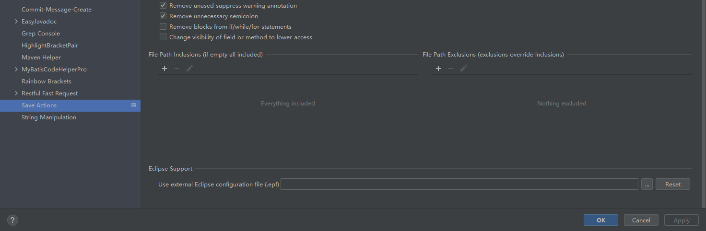​

#### 设置详解

##### General 基本设置

* Activate save actions on save(before saving each file,performs the configured actions below)

  ä¿å­˜æ—¶è‡ªåŠ¨æ ¼å¼åŒ–（在文件ä¿å­˜æ—¶å¯ç”¨/ç¦ç”¨è¯¥æ’件。在ä¿å­˜æ¯ä¸ªæ–‡ä»¶ä¹‹å‰ï¼Œå®ƒå°†æ‰§è¡Œä»¥ä¸‹é…置的动作）
* Activate save actions on shortcut

  使用快æ·é”®ä¿å­˜æ—¶è‡ªåŠ¨æ ¼å¼åŒ–

  使用场景：收到一份格å¼å¾ˆä¹±çš„文件，å¯ä»¥ä½¿ç”¨è¿™ä¸ªå¿«æ·é”®è‡ªåŠ¨æ ¼å¼åŒ–
* Activate save actions on batch(Code>Save Actions>Execute on multiple files)

  ä¿å­˜æ—¶æ‰¹é‡æ ¼å¼åŒ–

  这个没用过，因为有的时候你的格å¼åŒ–设置和åŒäº‹çš„ä¸ä¸€æ ·ï¼Œä¸€èµ·æ ¼å¼åŒ–了会导致åˆå¹¶æ—¶å€™æœ‰å†²çª
* No action if compile errors

  如æœæœ‰ç¼–译错误，则å¯ç”¨/ç¦ç”¨æ— åŠ¨ä½œã€‚å•ç‹¬åº”用äºæ¯ä¸ªæ–‡ä»¶

##### Formatting Actions æ ¼å¼åŒ–触å‘设置

* Optimize imports

  ä¼˜åŒ–å¯¼å…¥ï¼ˆæ²¡æœ‰ç”¨åˆ°çš„ç±»è‡ªåŠ¨åˆ å» import，这个一般è¦å‹¾é€‰ï¼‰
* Reformat file

  é‡æ–°æ ¼å¼åŒ–文件（åªè¦ä¿å­˜æ–‡ä»¶å°±ä¼šè‡ªåŠ¨æ ¼å¼åŒ–）
* Reformat only changed code (only if VCS configured)

  ä»…é‡æ ¼å¼åŒ–å·²(仅在é…ç½® VCS 的情况下)

  åªæœ‰åœ¨é…置了 VCS 的情况下，æ‰å¯ä»¥å¯¹æ›´æ”¹çš„代ç è¿›è¡Œæ ¼å¼åŒ–。
* Rerrange fields and methods(configured in “File>Setting>Editor>Code Style>(…)>Arragementâ€)

  é‡æ–°è°ƒæ•´å­—段和方法的范围

##### Build Actions build 设置

* Compile file

  编译文件

  对修改å的文件进行编译。编译器å¯èƒ½ä¹Ÿä¼šç¼–译其他文件。
* Reload file

  é‡æ–°åŠ è½½æ–‡ä»¶

  在è¿è¡Œä¸­çš„调试器中é‡æ–°åŠ è½½æ–‡ä»¶ï¼Œæ„味ç€è¿™äº›æ–‡ä»¶å°†é¦–先被编译。编译器å¯èƒ½ä¹Ÿä¼šç¼–译其他文件。
* Execute action

  执行动作

  使用快速列表执行动作

##### Java Inspection and Quick Fix 具体格å¼åŒ–设置

* Add final modifier to field

  给字段添加 `final`​ 修饰符

  ```java
  private int field = 0

  // å˜ä¸º

  private final int field = 0
  ```
* Add final modifier to local variable or parameter

  å‘局部å˜é‡æˆ–å‚数添加 `final`​ 修饰符

  使用效æœå¦‚下，所有的局部å‚数都添加了 `final`​ 修饰符

  ```java
  public void printStr(String str1, String str2, String str3) {
      int variable = 0
      System.out.println(str1 + str2 + str3);
  }

  // å˜ä¸º

  public void printStr(final String str1, final String str2, final String str3) {
      final int variable = 0
      System.out.println(str1 + str2 + str3);
  }
  ```
* Add final modifier to local variable or parameter except if it is implicit

  å‘ééšå¼çš„局部å˜é‡æˆ–å‚数添加 final 修饰符

  局部å˜é‡ `int variable = 0`​ å˜ä¸º `final int variable = 0`​ ，但如æœå®ƒæ˜¯éšå¼çš„，就åƒåœ¨ try ä¸­çš„èµ„æº `try (Resource r = new Resource())`​

  ä¸å¤ªç†è§£è¿™ä¸ªééšå¼æ˜¯ä»€ä¹ˆæ„æ€
* Add static modifier to methods

  如æœå†…容ä¸å¼•ç”¨å®ä¾‹å­—段，给方法添加 `static`​ 修饰符

  ```java
  private void testStatic(String str) {
      System.out.println(str);
  }

  // å˜ä¸º

  private static void testStatic(String str) {
      System.out.println(str);
  }
  ```
* Add this to field access

  字段的使用加上 `this`​
* Add this to method access

  方法使用加上 `this`​
* Add class qualifier to static member access

  é™æ€æˆå‘˜è®¿é—®æ·»åŠ ç±»é™å®šç¬¦

  对类字段的访问 `FIELD = 0`​ å˜ä¸º `Class.FIELD`​ 对å为 Class 的类的访问。ä¸â€œAdd class qualifier to static member access outside declaring class onlyâ€äº’斥。
* Add class qualifier to static member access outside declaring class only

  声æ˜ç±»å¤–çš„é™æ€æˆå‘˜è®¿é—®æ·»åŠ ç±»é™å®šç¬¦

  对äºä¸€ä¸ªå为 `class`​ 的类，对类字段 `FIELD = 0`​ 的访问å˜ä¸º `Class.FIELD`​ ，但åªæœ‰å½“é™æ€æˆå‘˜åœ¨å£°æ˜ç±»ä¹‹å¤–æ—¶æ‰ä¼šå¦‚此。ä¸â€œAdd class qualifier to static member accessâ€äº’斥。
* Add missing @Override annotations

  如æœæ–¹æ³•è¦†ç›–了父类的一个方法，添加æ¼å†™çš„ `@Override`​ 注解

  ```java
  void method()

  // å˜ä¸º

  @Override
  void method()
  ```
* Add blocks to if/while/for statements

  ç»™ if/while/for 语å¥æ·»åŠ å¤§æ‹¬å·

  ```java
  public String judgeIt(int a) throws Exception {
      if (a == 3) return "yes";
      throw new Exception();
  }

  // å˜ä¸º

  public String judgeIt(int a) throws Exception {
      if (a == 3) {
          return "yes";
      }
      throw new Exception();
  }
  ```
* Add missing serialVersionUID field for Serializable classes

  为 `Serializable`​ 类添加缺少的 `serialVersionUID`​ 字段

  ```java
  public class BasicEntity implements Serializable {

      // 这是生æˆçš„
      private static final long serialVersionUID = -1134102816751244744L;

  }
  ```
* Remove blocks from if/while/for statements

  ç»™ if/while/for 语å¥ç§»é™¤å¤§æ‹¬å·

  ```java
  public String judgeIt(int a) throws Exception {
      if (a == 3) {
          return "yes";
      }
      throw new Exception();
  }

  // å˜ä¸º

  public String judgeIt(int a) throws Exception {
      if (a == 3) return "yes";
      throw new Exception();
  }
  ```
* Remove unnecessary this to field and method

  给字段或者方法å»æ‰ä¸å¿…è¦çš„ `this`​

  ```java
  this.field = 0

  // å˜ä¸º

  field = 0
  ```
* Remove final from private method

  ç§æœ‰æ–¹æ³•å»æ‰ `final`​ 关键字

  ```java
  private final String getStr(final String str) {
      return str;
  }

  // å˜ä¸º

  private String getStr(final String str) {
      return str;
  }
  ```
* Remove unnecessary final to local variable or parameter

  局部å˜é‡å»æ‰ `final`​

  ```java
  int final variable = 0

  // å˜ä¸º

  int variable=0
  ```
* Remove explicit generic type for diamond

  删除显å¼æ³›å‹ç±»å‹çš„尖括å·

  ```java
  List<String> list = new ArrayList<String>()

  // å˜ä¸º

  List<String> list = new ArrayList<>()
  ```
* Remove unused suppress warning annotation

  如æœæ³¨è§£ `@SuppressWarning`​ 未被使用，它将被删除
* Remove unnecessary semicolon

  删除ä¸å¿…è¦çš„分å·

  ```java
  int variable = 0;;

  // å˜ä¸º

  int variable = 0;
  ```
* Change visibility of field or method to lower access

  更改字段或方法的å¯è§æ€§ä»¥é™ä½è®¿é—®æƒé™ã€‚如æœå­—段ä¸åœ¨ç±»å¤–使用，将把 `public`​ 改为 `private`​ 。它也适用äºæ–¹æ³•ã€‚

  ```java
  public int field = 0

  // å˜ä¸º

  private int field = 0
  ```

## VM å‚考é…ç½®

```properties
# 堆栈设置
# 设置堆的åˆå§‹å¤§å°å’Œæœ€å¤§å¤§å°
-Xms4g
-Xmx4g

# 元空间设置
# 设置元空间的åˆå§‹å¤§å°å’Œæœ€å¤§å¤§å°
-XX:MetaspaceSize=512m
-XX:MaxMetaspaceSize=1024m

# 代ç ç¼“存设置
# 设置åˆå§‹ä»£ç ç¼“存大å°å’Œä¿ç•™ä»£ç ç¼“存大å°
-XX:InitialCodeCacheSize=512m
-XX:ReservedCodeCacheSize=1024m

# åƒåœ¾å›æ”¶å‚æ•°
# 使用并å‘标记清除（ConcMarkSweep）åƒåœ¾å›æ”¶å™¨
-XX:+UseConcMarkSweepGC
# 设置并行åƒåœ¾å›æ”¶çº¿ç¨‹æ•°
-XX:ParallelGCThreads=4

# JIT（å³æ—¶ç¼–译）å‚æ•°
# 设置编译器线程数
-XX:CICompilerCount=2
# 设置åœæ­¢çº§åˆ«ï¼Œåªè¿›è¡Œç¬¬ä¸€çº§åˆ«çš„编译
-XX:TieredStopAtLevel=1
# 设置最大内è”级别
-XX:MaxInlineLevel=9
# 设置第四层（Tier 4）最å°è°ƒç”¨é˜ˆå€¼
-XX:Tier4MinInvocationThreshold=50000
# 设置第四层（Tier 4）调用阈值
-XX:Tier4InvocationThreshold=100000
# 设置第四层（Tier 4）编译阈值
-XX:Tier4CompileThreshold=150000

# 其他设置
# ç¦ç”¨è§„范化的文件路径缓存
-Dsun.io.useCanonPrefixCache=false
# 设置首选使用IPv4å议栈
-Djava.net.preferIPv4Stack=true
# ç¦ç”¨HTTP隧é“身份验è¯
-Djdk.http.auth.tunneling.disabledSchemes=""

# 错误日志和堆转储设置
# 在å‘生内存溢出错误时生æˆå †è½¬å‚¨æ–‡ä»¶
-XX:+HeapDumpOnOutOfMemoryError
# ç¦ç”¨å¿«é€ŸæŠ›å‡ºå¼‚常时的堆栈跟踪çœç•¥
-XX:-OmitStackTraceInFastThrow
# å…许自我附加
-Djdk.attach.allowAttachSelf

# 错误日志文件路径
-XX:ErrorFile=$USER_HOME/java_error_in_idea_%p.log
# 堆转储文件路径
-XX:HeapDumpPath=$USER_HOME/java_error_in_idea.hprof

# 其他é…ç½®
# 打开指定包的包访问æƒé™
--add-opens=java.base/jdk.internal.org.objectweb.asm=ALL-UNNAMED
--add-opens=java.base/jdk.internal.org.objectweb.asm.tree=ALL-UNNAMED
# 虚拟机在å¯åŠ¨æ—¶é¢„先分é…堆空间
-XX:+AlwaysPreTouch
# å¯ç”¨å‹ç¼©æŒ‡é’ˆï¼ˆCompressed Oops）技术。在64ä½çš„JVM中，å¯ç”¨å‹ç¼©æŒ‡é’ˆå¯ä»¥å‡å°‘对象引用的内存å ç”¨ï¼Œæ高堆的使用效ç‡ã€‚
-XX:+UseCompressedOops
# 设置文件编ç ä¸ºUTF-8
-Dfile.encoding=UTF-8
# 破解包ä½ç½®
-javaagent:D:\ja-netfilter\ja-netfilter.jar=jetbrains
# JDK VisualGC æ’件
--add-exports=jdk.internal.jvmstat/sun.jvmstat.monitor=ALL-UNNAMED
--add-exports=jdk.internal.jvmstat/sun.jvmstat.monitor.event=ALL-UNNAMED
--add-exports=jdk.internal.jvmstat/sun.jvmstat.perfdata.monitor=ALL-UNNAMED
```

## JetBrains Toolbox App

个人觉得这是**必装**的一个软件ï¼ï¼ï¼å®ƒå¯ä»¥è½»æ¾åœ°ç®¡ç†æ‚¨çš„ IDE。

功能特点如下：

1. 快速轻æ¾åœ°æ›´æ–°ç®¡ç†æ‚¨çš„ JetBrains å·¥å…·ï¼ŒåŒ…å« å®‰è£…ã€è‡ªåŠ¨æ›´æ–°ã€åŒæ—¶æ›´æ–°æ’件和 IDE ã€å›æ»šå’Œé™çº§

   通过下载补ä¸æˆ–一组补ä¸è€Œä¸æ˜¯æ•´ä¸ªåŒ…，节çœç»´æŠ¤ IDE 的时间和精力。在您编程的åŒæ—¶ï¼Œåœ¨åå°æ›´æ–°æ‰€æœ‰å†…容。
2. 查看最新å˜åŒ–

   借助 JetBrains Toolbox App，您å¯ä»¥åœ¨æ›´æ–°ä¹‹å‰é˜…读有关 IDE 中的最新功能和错误修å¤çš„所有信æ¯ã€‚
3. åŒæ—¶ç»´æŠ¤å¤šä¸ªç‰ˆæœ¬

   è½»æ¾å¤„ç†åŒä¸€å·¥å…·çš„多个版本。通过 JetBrains Toolbox App å®‰è£…å’Œæ›´æ–°ï¼Œç¬¬ä¸€æ—¶é—´äº«å— JetBrains IDE 抢先体验计划 (EAP) å’Œ Google çš„ Android Studio ç‰ˆæœ¬ä¸ Canary æ„建。
4. å³æ—¶æ‰“开项目

   所有项目都唾手å¯å¾—，而且您的收è—夹固定在顶部。使用 Search 字段快速找到它们，åªéœ€ç‚¹å‡»ä¸€æ¬¡å³å¯åœ¨ IDE 中立å³å°†å…¶æ‰“开。
5. è¿æ¥åˆ°å›¢é˜Ÿå·¥å…·

   登录您的 JetBrains Space，ä»â€œé¡¹ç›®â€æ ‡ç­¾é¡µä¸­ä¸€é”®è®¿é—®æ‚¨æœ€å–œæ¬¢çš„项目。
6. ä¸ GitHubã€GitLab 或 Bitbucket 集æˆ

   安装 [Google Chrome](https://chrome.google.com/webstore/detail/jetbrains-toolbox/offnedcbhjldheanlbojaefbfbllddna) 或 [Firefox](https://addons.mozilla.org/en-US/firefox/addon/jetbrains-toolbox/) 的扩展，您就å¯ä»¥ç›´æ¥ä»æµè§ˆå™¨ä¸­å…‹éš†å¹¶æ‰“å¼€ GitHubã€GitLab 或 Bitbucket 仓库。

主è¦åŠŸèƒ½æˆªå›¾å¦‚下：

​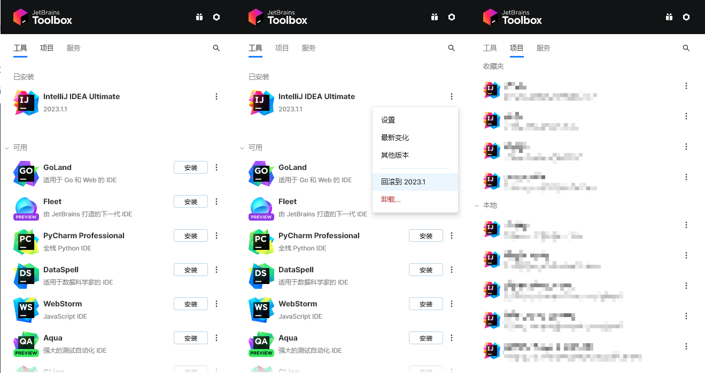​

## IDEA 的一些优化

官方é…置详细介ç»ï¼š[https://www.jetbrains.com/help/idea/getting-started.html](https://www.jetbrains.com/help/idea/getting-started.html)

### 自定义代ç æ¨¡æ¿

举个例å­ï¼šåªè¦è¾“å…¥ apr，就能自动æç¤ºï¼Œå¹¶ä¸”ç”Ÿæˆ `@Autowired`​ 语å¥ã€‚

å¯ä»¥æ ¹æ®è‡ªå·±çš„代ç ä¹ æƒ¯ï¼Œè‡ªå®šä¹‰ä¸€äº›ä»£ç æ¨¡æ¿ï¼Œå¸®åŠ©æˆ‘们快速写代ç ã€‚

​​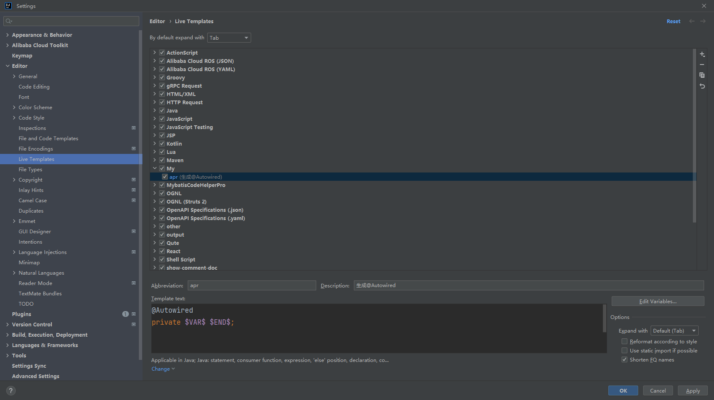​​

使用效æœå¦‚图：

​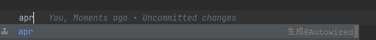​

### 修改全局é…ç½®

#### 优化导包é…ç½®

​​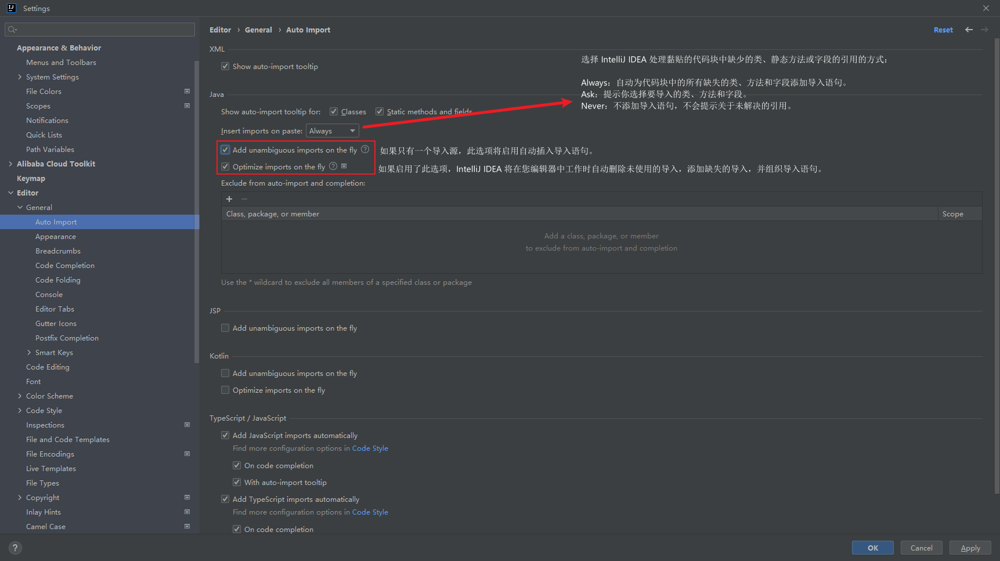

打开设置，找到 File | Settings | Editor | Code Style | Java ç•Œé¢çš„ imports 页签，导入数é‡è®¾ç½®ä¸º `999`​，如下图，这样就会é¿å…导包为 `*`​

​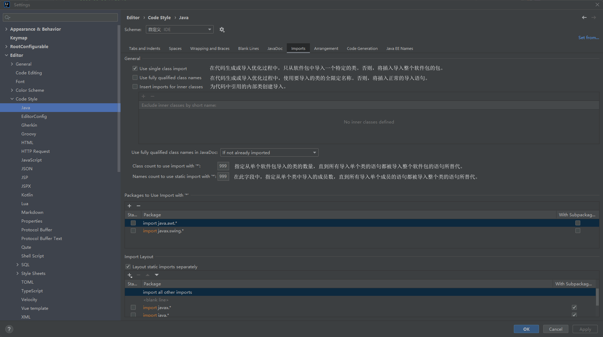​

#### 解决注释åªè¯»æ¨¡å¼

##### æ–¹å¼ä¸€

å»æ‰ `Render documentation comments`​ 勾选å³å¯ã€‚

​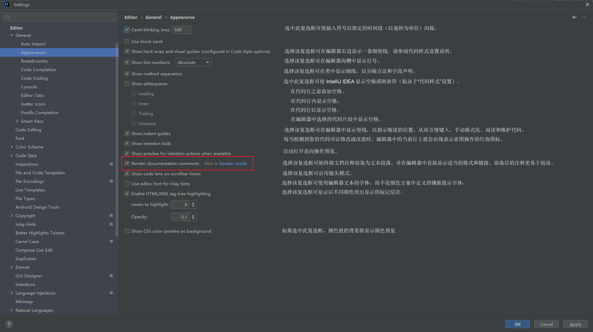​

##### æ–¹å¼äºŒ

ä¼¼ä¹åªéœ€è¦è¿›è¡Œä¸‹æ–¹ä¸¤æ­¥æ“作å³å¯ã€‚

​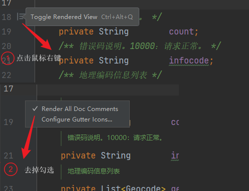​

其他说æ˜ï¼ˆä¼¼ä¹ä¸Šæ–¹æ‰§è¡Œåå³å¯.....）：

​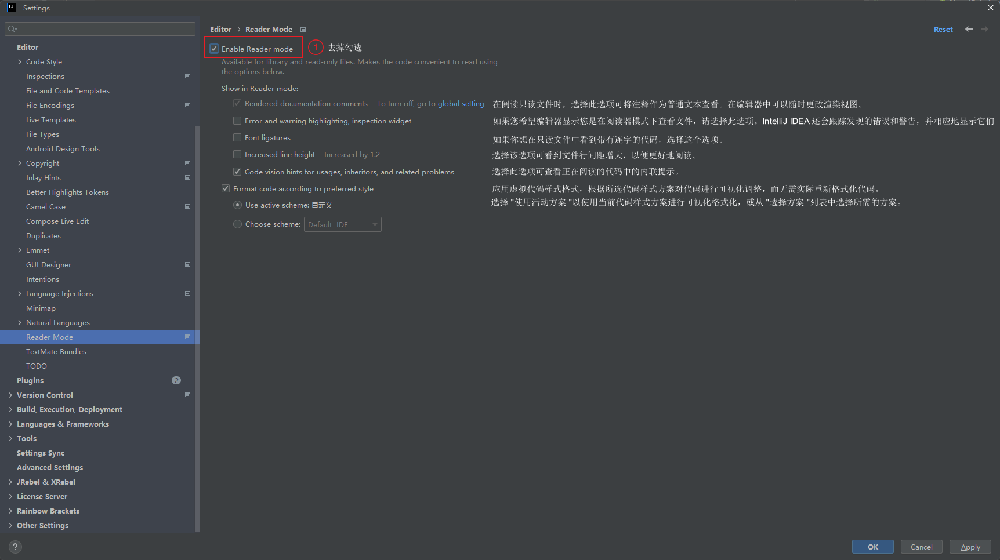​

#### å–消 tab 页å•è¡Œæ˜¾ç¤º

​​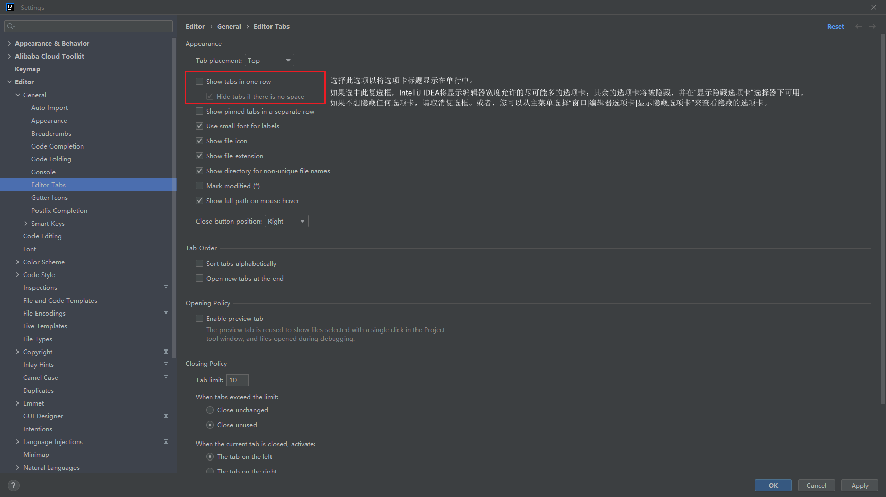​​

å»æ‰å‹¾é€‰å，效æœå¦‚下：

​​​​

#### 代ç æ ¼å¼åŒ–é£æ ¼

举个例å­ï¼šå˜é‡å¯¹é½

​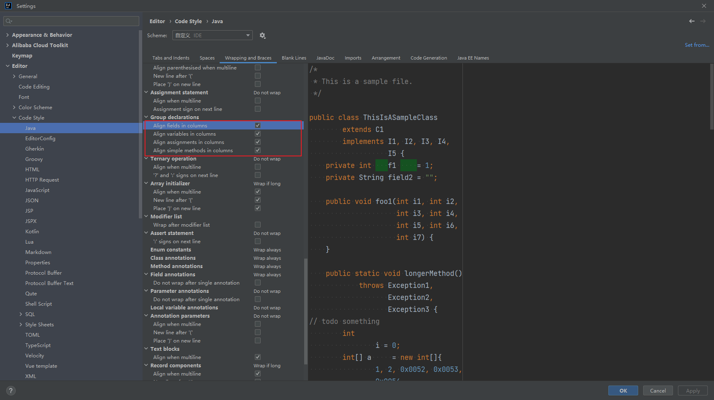

我的é…置（点击 Scheme å³è¾¹çš„å°é½¿è½®å¯ä»¥å¯¼å…¥ï¼‰ï¼š

```xml
<code_scheme name="Default" version="173">
  <JavaCodeStyleSettings>
    <option name="GENERATE_FINAL_LOCALS" value="true" />
    <option name="REPLACE_INSTANCEOF_AND_CAST" value="true" />
    <option name="ALIGN_MULTILINE_TEXT_BLOCKS" value="true" />
    <option name="JD_DO_NOT_WRAP_ONE_LINE_COMMENTS" value="true" />
  </JavaCodeStyleSettings>
  <codeStyleSettings language="JAVA">
    <option name="LINE_COMMENT_AT_FIRST_COLUMN" value="false" />
    <option name="BLOCK_COMMENT_AT_FIRST_COLUMN" value="false" />
    <option name="LINE_COMMENT_ADD_SPACE" value="true" />
    <option name="BLOCK_COMMENT_ADD_SPACE" value="true" />
    <option name="LINE_COMMENT_ADD_SPACE_ON_REFORMAT" value="true" />
    <option name="ALIGN_MULTILINE_PARAMETERS_IN_CALLS" value="true" />
    <option name="ALIGN_MULTILINE_THROWS_LIST" value="true" />
    <option name="ALIGN_MULTILINE_EXTENDS_LIST" value="true" />
    <option name="ALIGN_MULTILINE_ARRAY_INITIALIZER_EXPRESSION" value="true" />
    <option name="ALIGN_GROUP_FIELD_DECLARATIONS" value="true" />
    <option name="ALIGN_CONSECUTIVE_VARIABLE_DECLARATIONS" value="true" />
    <option name="ALIGN_CONSECUTIVE_ASSIGNMENTS" value="true" />
    <option name="ALIGN_SUBSEQUENT_SIMPLE_METHODS" value="true" />
    <option name="PREFER_PARAMETERS_WRAP" value="true" />
    <option name="METHOD_PARAMETERS_WRAP" value="1" />
    <option name="RESOURCE_LIST_WRAP" value="1" />
    <option name="EXTENDS_LIST_WRAP" value="1" />
    <option name="THROWS_LIST_WRAP" value="1" />
    <option name="EXTENDS_KEYWORD_WRAP" value="1" />
    <option name="THROWS_KEYWORD_WRAP" value="1" />
    <option name="METHOD_CALL_CHAIN_WRAP" value="5" />
    <option name="KEEP_SIMPLE_LAMBDAS_IN_ONE_LINE" value="true" />
    <option name="KEEP_SIMPLE_CLASSES_IN_ONE_LINE" value="true" />
    <option name="ARRAY_INITIALIZER_WRAP" value="1" />
    <option name="ARRAY_INITIALIZER_LBRACE_ON_NEXT_LINE" value="true" />
    <option name="ARRAY_INITIALIZER_RBRACE_ON_NEXT_LINE" value="true" />
    <option name="WRAP_COMMENTS" value="true" />
    <option name="IF_BRACE_FORCE" value="3" />
    <option name="DOWHILE_BRACE_FORCE" value="3" />
    <option name="WHILE_BRACE_FORCE" value="3" />
    <option name="FOR_BRACE_FORCE" value="3" />
    <option name="ENUM_CONSTANTS_WRAP" value="2" />
  </codeStyleSettings>
</code_scheme>
```

#### Tab 转 空格

​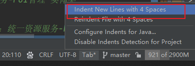​

#### åŒæ–œæ æ³¨é‡Šç´§è·Ÿä»£ç å¤´

​​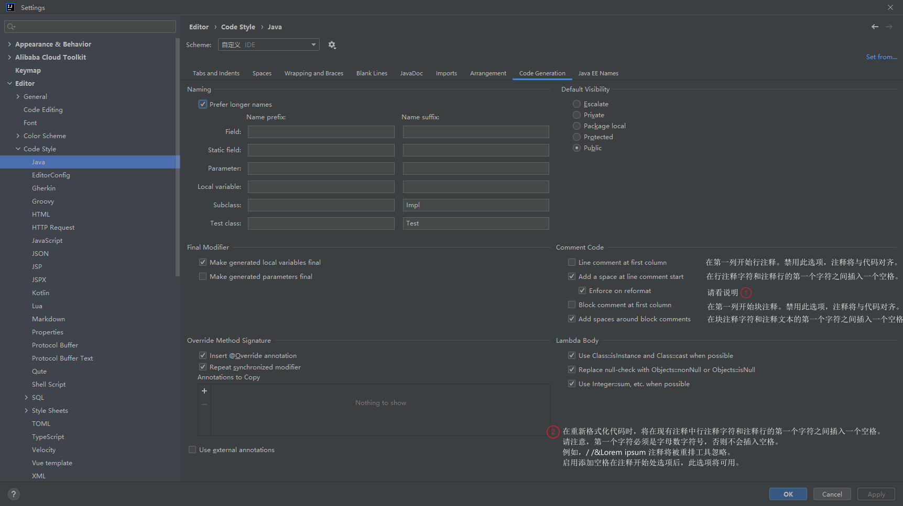​​

å»æ‰å‹¾é€‰å，效æœå¦‚下：

​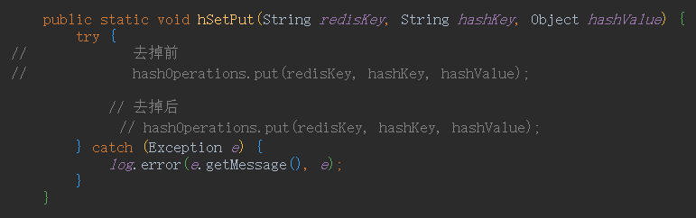​

#### å–消匹é…大å°å†™

​​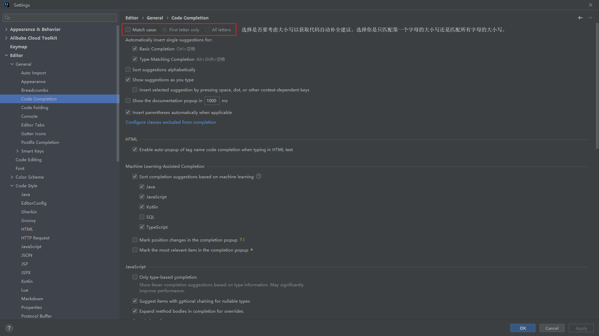​​

å»æ‰å‹¾é€‰å，效æœå¦‚下：

​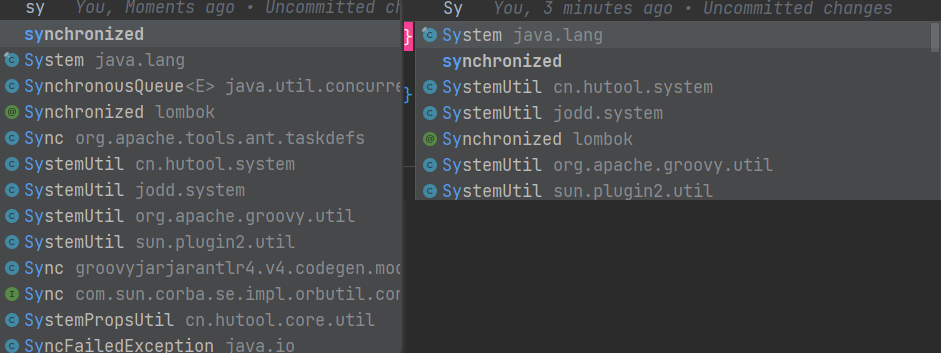​

输入å°å†™ `s`​，也能æ示出 `String`​

#### 创建文件时生æˆä½œè€…和时间信æ¯

​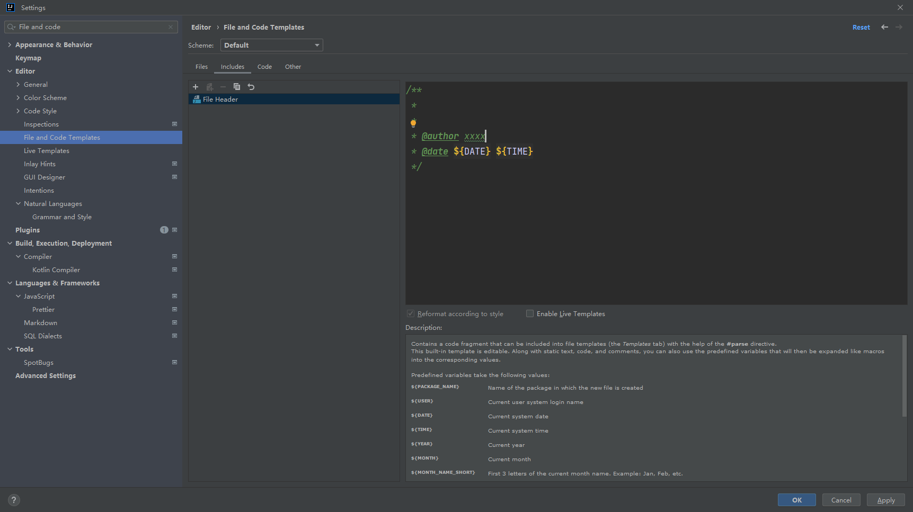​

#### 显示行å·å’Œæ–¹æ³•åˆ†å‰²çº¿

​​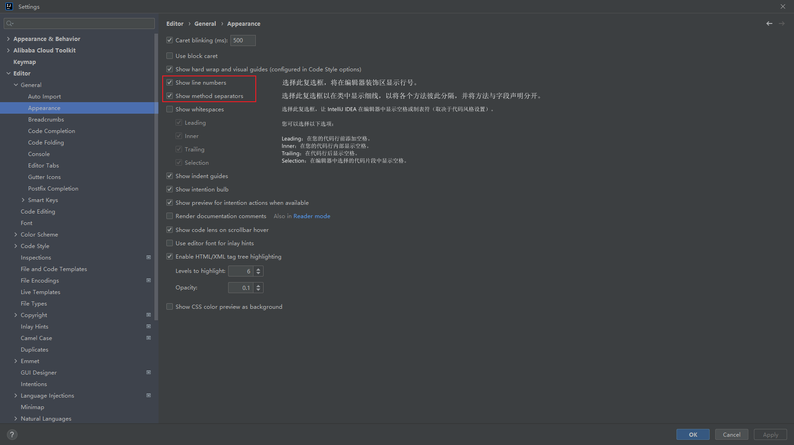​​

选中å效æœå¦‚下：

​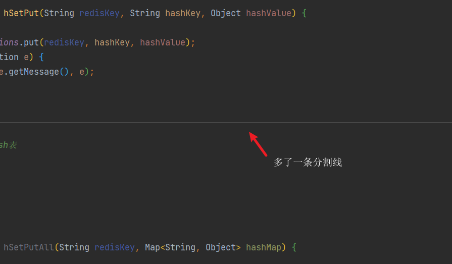​

#### 代ç ä¿å­˜å自动触å‘æ“作

​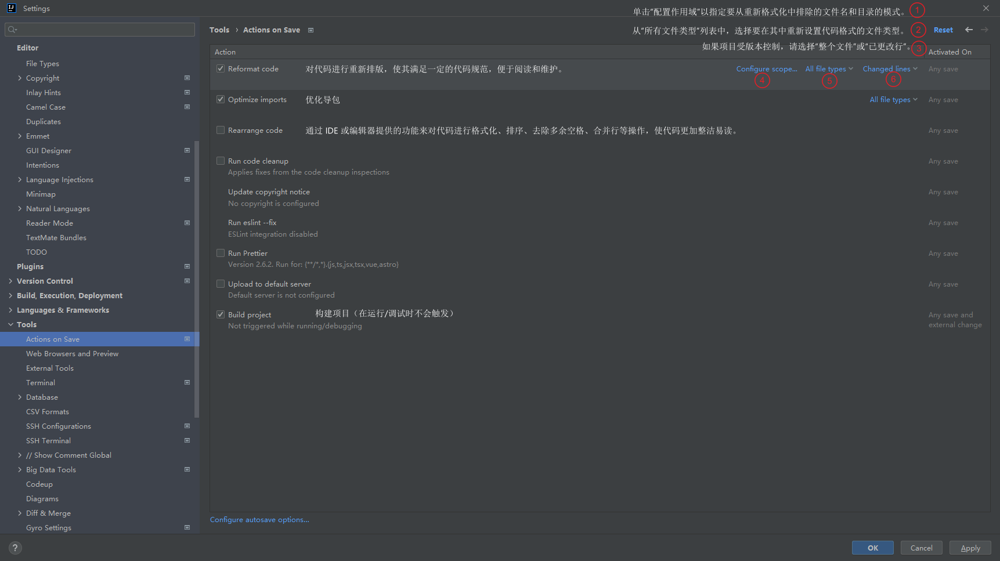

ä¿å­˜æ–‡ä»¶çš„一些é…ç½®

​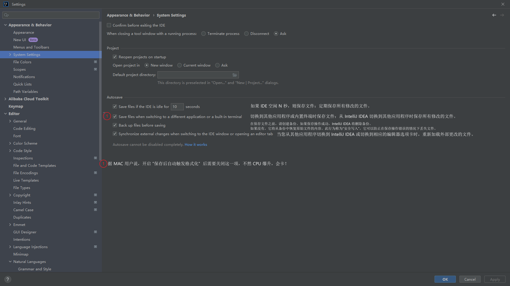​

å¯å‚考 [Rearrange code 官方教程](https://www.jetbrains.com/help/idea/rearrange-code.html)

#### 忽略文件和文件夹

IntelliJ IDEA 还维护ç€ä¸€ä¸ªæ–‡ä»¶å’Œæ–‡ä»¶å¤¹åˆ—表，这些文件和文件夹完全被æ’除在任何处ç†ä¹‹å¤–（包å«æœç´¢ç­‰ï¼‰ã€‚该列表包括临时文件ã€ä¸ç‰ˆæœ¬æ§åˆ¶ç³»ç»Ÿç›¸å…³çš„æœåŠ¡æ–‡ä»¶ç­‰ã€‚笔者一般是加上下é¢å‡ ä¸ªå¿½ç•¥ï¼š

```
.flattened-pom.xml
.fastRequest
```

​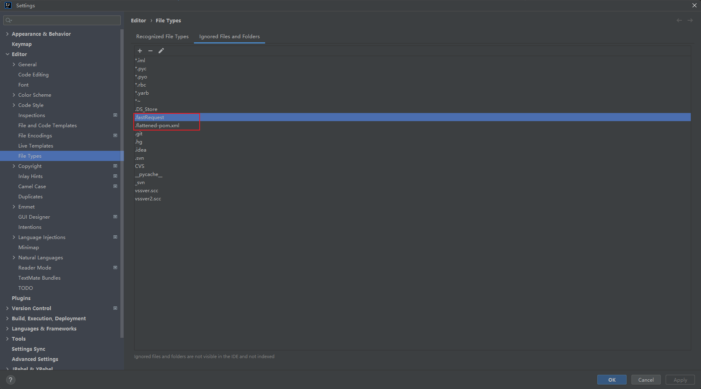​

#### 新版 IDEA 没有 Local Changes

​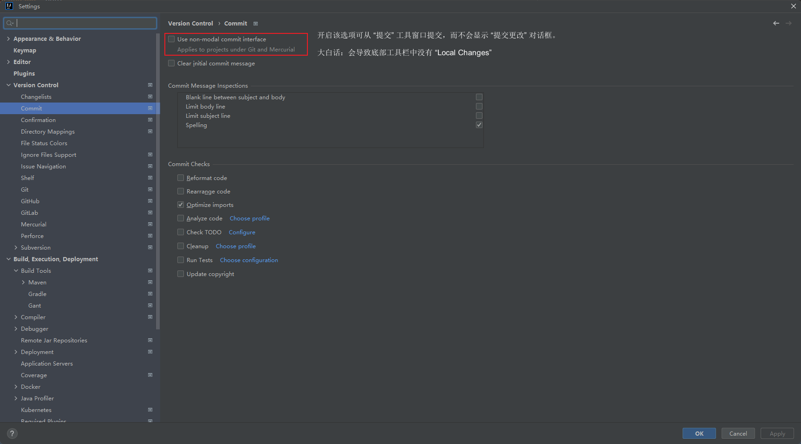​

#### å–消 AI 自动补全

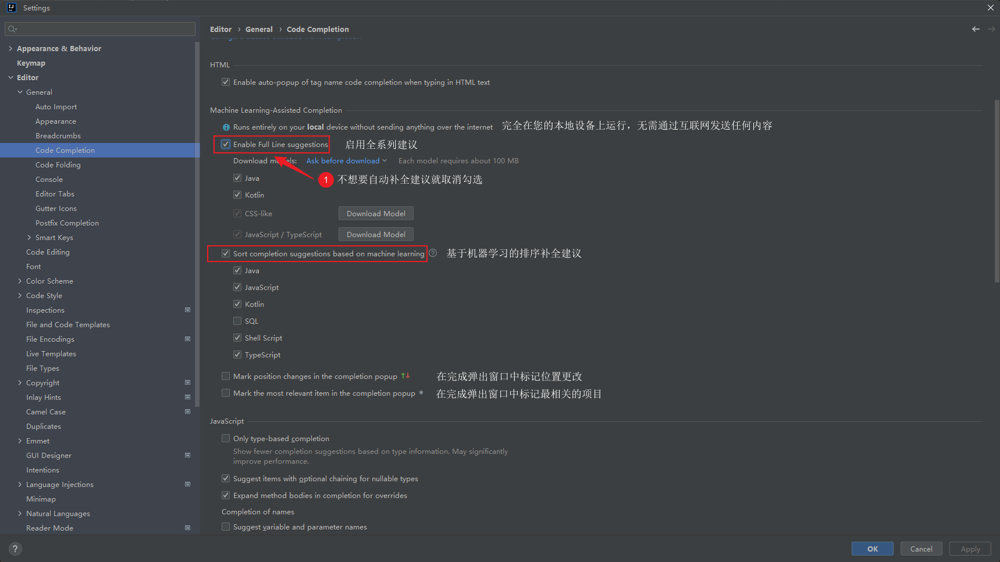​

## 一些问题

### ä¸æƒ³è¦ Services 窗å£æ€ä¹ˆæ“作？

当你的项目是 SpringBoot 项目时，åˆä¸å°å¿ƒå¼€å¯äº† Services 。跑项目时都是在那逗比的 Services 框框里，åˆå¾ˆçƒ¦ï¼Œè¿™æ—¶å€™è¯¥æ€ä¹ˆæ“作关闭呢？

1. 打开 Services 窗å£ï¼Œæœæ–­çš„选择 Spring Boot 分钟，然å干净利è½çš„å³é”®ç‚¹å‡» Delete 按钮删除。这时，ä¸å‡ºæ„外的è¯ï¼ŒServices 窗å£å·²ç»æ¶ˆå¤±äº†ã€‚

    ​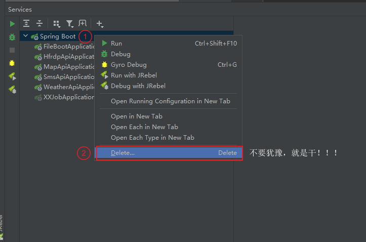​
2. ç›´æ¥ç‚¹å‡»å³ä¸Šè§’çš„ Debug è¿è¡Œé¡¹ç›®ï¼Œå°±åˆèƒ½å¼€å¿ƒçš„看到简å•çš„ Run 窗å£äº†ã€‚

    ​​

### Jrebel debug 无法å¯åŠ¨

在新版本的 IDEA 中 Jrebel debug 模å¼æ— æ³•æ­£å¸¸å·¥ä½œæ—¶ï¼Œå¯å°è¯•è¿›è¡Œä¸€ä¸‹ä»¥ä¸‹è®¾ç½®ã€‚

​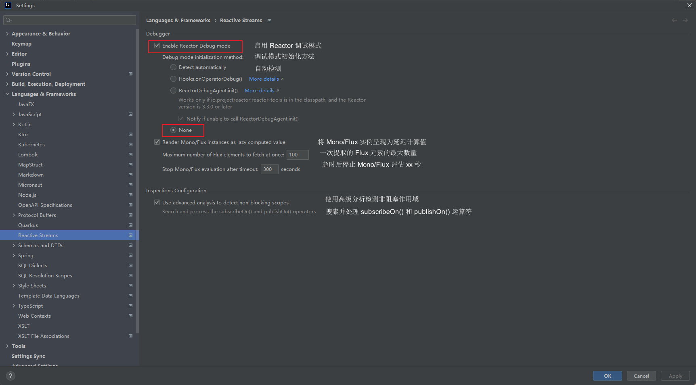​

### Easy Yapi

​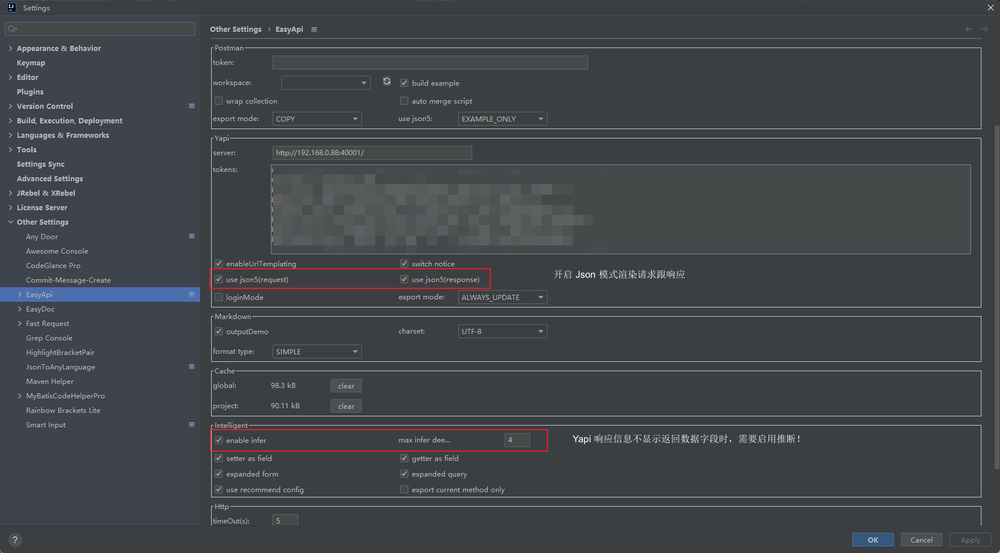​

## å‚考文章

1. [ç©è½¬ IDEA](https://juejin.cn/column/7079814112984694814)
